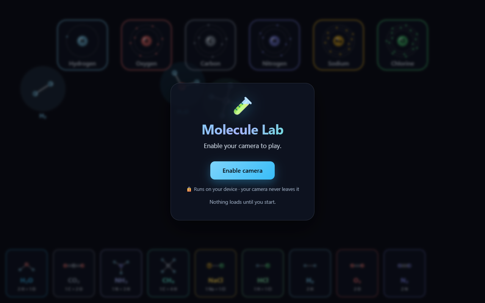

# 🧪 Molecule Lab

**Build molecules with your hands.** An interactive, in-browser chemistry lab where
you pick up elements and combine them into real molecules using hand-tracking over
your webcam — no controllers, no installs.

🔗 **[Play it live →](https://damiansire.github.io/web-ar-molecule-lab/)**



## How to play

1. Click **Enable camera** and allow access.
2. **Hover your fingertip** over an element tile to pick it up (hold to grab, hold
   again to stack more atoms).
3. **Bring both hands together** while holding elements to combine them into a molecule.
4. Or just **say an element out loud** — voice naming drops it into a free hand.

Two modes, toggled with the on-screen button (hold to switch):

- **🔬 Explore** — free play. Discover molecules and read what each one is.
- **⚡ Challenge** — molecules fall from the top; assemble them before they reach
  the bottom to score and build combos.

## Chemistry

- **Elements:** H · O · C · N · Na · Cl
- **Molecules:** H₂O, CO₂, NH₃, CH₄, NaCl, HCl, H₂, O₂, N₂

## Privacy

Everything runs **on your device**. The camera stream and the hand-tracking model
execute locally in your browser — the video never leaves your machine. Nothing is
loaded or contacted until you click *Enable camera*.

## Tech

- **Vite + TypeScript**, rendered on a 2D `<canvas>` HUD over the mirrored webcam.
- **Hand tracking** via [MediaPipe Tasks Vision](https://developers.google.com/mediapipe),
  running in a Web Worker so inference never blocks the render loop.
- **Voice input** via the Web Speech API (optional; the game works fully on gestures
  alone).
- A strict **Content-Security-Policy** is injected at build time, scoping network
  access to only the CDNs strictly required by the tracking model.

## Development

```bash
npm install
npm run dev       # dev server at /web-ar-molecule-lab/
npm test          # unit tests (chemistry, hands, voice)
npm run build     # production build → dist/
```

> Requires a browser with `getUserMedia` (camera) support. A microphone is optional
> and only used for voice naming.

## Deployment

Pushing to `master` triggers a GitHub Actions workflow that builds the project and
publishes `dist/` to GitHub Pages. The Vite `base` is set to `/web-ar-molecule-lab/`
to match the Pages subpath.
